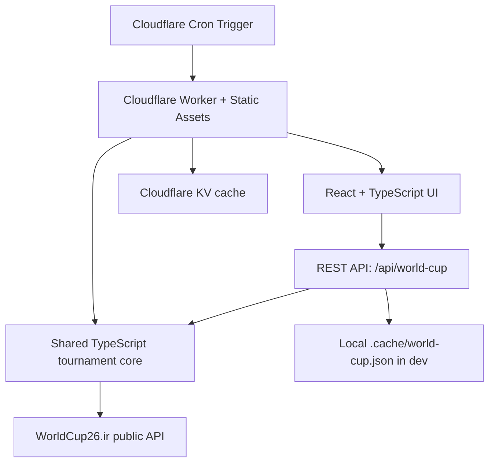

# Road to 26

A lightweight FIFA World Cup 2026 tracker for groups, fixtures, standings, match locations, kickoff times, and the path into the Round of 32.

The idea's simple: open it during the tournament and quickly see what's happening now, what's next, and who's projected to advance.

Live demo: https://road-to-26.inti4.workers.dev

## Why I built it

I was following the World Cup through Google's results panel and it got tedious to manage. It's fine for a single score, but clumsy when you want the whole picture at a glance. So I built one clear place to see group standings, who's played and who plays next, which third-place teams are currently projected to advance, and how the knockout bracket fills in, all without clicking around.

## What it does

- Shows all 12 group tables with points, record, goal difference, and current advancement status.
- Shows each group's played matchups, scores, and upcoming group fixtures.
- Shows upcoming matches, venues, cities, and kickoff times.
- Shows live scores and goal scorers for matches that are in progress or final.
- Supports time-zone display toggles for Eastern, Central, Pacific, and venue-local time.
- Shows the knockout path from group stage into the Round of 32 and beyond.
- Projects the top eight third-place teams based on currently available standings.
- Shows a ranked third-place table with the top-eight cut line.
- Resolves later knockout placeholders like `Winner Match 73` into possible teams from the earlier match.
- Includes dark mode and responsive layouts for laptop/desktop and mobile.
- Displays when the data was last refreshed and when the next server-side data check is scheduled.

## Current stack



The current local stack is:

```txt
React + TypeScript + Vite frontend
        │
        ▼
TypeScript Express dev/prod server
        │
        ▼
Shared tournament normalization modules
        │
        ▼
WorldCup26.ir public API
        │
        ▼
.cache/world-cup.json
```

### Frontend

- React lives in `src/App.tsx`.
- Styling lives in `src/styles.css`.
- The client fetches data from `/api/world-cup` through `src/useWorldCupData.ts`.
- Fallback/mock-ish local data lives in `src/data.ts` for cases where live data is unavailable.
- Shared app/API types live in `src/shared/types.ts`.
- Time-zone helpers live in `src/shared/time.ts`.
- Tournament normalization, refresh scheduling, bracket building, and projection logic live in `src/shared/worldCup.ts`.

### Backend

- `server.ts` is the local dev server.
- In development, Express mounts Vite middleware.
- The hosted production target is the Cloudflare Worker in `worker/index.ts`.
- API endpoints:
  - `GET /api/world-cup` returns normalized tournament data for the UI.
  - `GET /api/world-cup/status` returns cache/provider refresh status.
  - `POST /api/world-cup/refresh` manually refreshes the cache when called with `REFRESH_SECRET`.

### Tests

Vitest covers the high-signal logic:

- Refresh scheduling.
- Time-zone conversion and display formatting.
- Provider fixture/standing normalization.
- Knockout bracket stage mapping.
- Third-place advancement projection.

Run:

```bash
npm run test
```

## Data source

The current app uses the public WorldCup26.ir API:

- `https://worldcup26.ir/get/games`
- `https://worldcup26.ir/get/groups`
- `https://worldcup26.ir/get/teams`
- `https://worldcup26.ir/get/stadiums`

No API key is required for the current data flow.

The app does read `.env.local` and `.env` with `dotenv`, and this project may still have old API-Football variables locally, but the current implementation does not use API-Football. We switched away from that path because the free API-Football plan appeared to block or limit 2026 World Cup data.

## Refresh and caching behavior

The important bit: provider requests are based on match timing, not visitor traffic.

Visitors hit our own `/api/world-cup` endpoint. The Express server keeps an in-memory cache and persists it to:

```txt
.cache/world-cup.json
```

Refresh policy in `src/shared/worldCup.ts`:

- If a match is live, refresh every minute.
- If kickoff is within 10 minutes, refresh every minute.
- If kickoff is within 1 hour, refresh every 5 minutes.
- Otherwise, refresh about 10 minutes before the next match, capped at one daily check.
- If the provider fails but a cache exists, serve cached data and retry later.
- Static data like teams and stadiums is fetched once per cache lifecycle, then reused.

This keeps provider usage low while still updating meaningfully during live windows.

## Current limitations

- WorldCup26.ir is a public/open endpoint, so there is no formal quota or SLA in this app.
- The cache is local filesystem-based, which is fine locally but not ideal for serverless hosting.
- The third-place projection is a practical estimate based on available standings fields. It does not yet fully compute every FIFA tiebreaker, such as team conduct score or FIFA ranking.
- Group table sorting currently depends on the provider standings plus basic numeric ordering. Full official tiebreaker simulation would need more fields.
- The local Express server is still useful for development, but the hosted backend is the Cloudflare Worker in `worker/index.ts`.
- Once all group-stage matches are final, the app locks third-place statuses: top-eight third-place teams show as advancing, and the remaining third-place teams show as eliminated instead of possible.

## Why Cloudflare

The app doesn't need an always-on server, so it runs entirely on Cloudflare:

- The Worker serves the React build from `dist/` and handles `/api/*`.
- KV stores the cached tournament JSON (replacing the local `.cache/` file).
- Cron Triggers keep the cache warm on a schedule.
- It stays on a $0/month hosting tier for this project's traffic.

## Local development

Install dependencies:

```bash
npm install
```

Run locally:

```bash
npm run dev
```

Open:

```txt
http://127.0.0.1:5173/
```

Build the frontend:

```bash
npm run build
```

Run the production server locally:

```bash
npm start
```

## Environment variables

No environment variables are required for the current public WorldCup26.ir setup.

## Hosting with Cloudflare

The preferred $0/month hosting path is a single Cloudflare Worker with Static Assets and KV.

Target architecture:

```txt
Cloudflare Worker
  serves the React build from dist/
  handles /api/world-cup
  normalizes data
  reads/writes cached JSON

Cloudflare KV
  stores the tournament cache

Cloudflare Cron Trigger
  refreshes the cache on a schedule
```

Cloudflare files:

- `worker/index.ts`
- `wrangler.toml`

Worker endpoints:

- `GET /api/world-cup`
- `GET /api/world-cup/status`
- `POST /api/world-cup/refresh`

One-time Cloudflare setup:

```bash
npx wrangler login
npx wrangler kv namespace create WORLD_CUP_CACHE
npx wrangler kv namespace create WORLD_CUP_CACHE --preview
npx wrangler secret put REFRESH_SECRET
```

The current `wrangler.toml` is already configured with this project's KV namespace IDs.

Run tests and build:

```bash
npm run test
npm run build
```

Run the Worker locally with Cloudflare's runtime:

```bash
npm run worker:dev
```

Deploy the Worker:

```bash
npm run worker:deploy
```

Why Cloudflare fits:

- Worker Static Assets can host the static React UI.
- Workers replace the hosted Express API layer.
- KV replaces `.cache/world-cup.json`.
- Cron Triggers can keep the data warm without relying on a laptop or always-on Node server.
- The free limits should be plenty for this project's small JSON payload and low request volume.
- Live deployment: https://road-to-26.inti4.workers.dev
